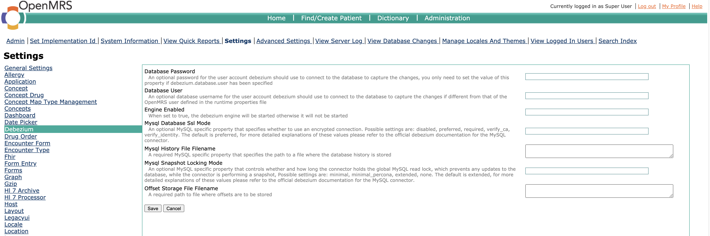

# Debezium Module
Provides a mechanism to monitor changes in specific tables in an OpenMRS database using an embedded [debezium](https://debezium.io/) engine 
and notifies any configured listeners. The module is designed to implement the [change data capture](https://en.wikipedia.org/wiki/Change_data_capture) pattern. 
Currently, the only monitored operations are row level inserts, updates and deletes.

### Technical Overview


As shown in the diagram above, the module runs an embedded debezium engine and registers a single change event `Consumer` 
with the engine, the consumer gets notified of database changes, it first runs the raw debezium `ChangeEvent` object 
through a `Function` to convert it to a `DatabaseEvent` object before notifying a single registered spring bean named 
`dbEventListener` implementing the `DatabaseEventListener` interface, the engine **WILL NOT** start if this spring 
bean is not found. If any error is encountered during processing of the event be it in the listener, the engine is 
stopped immediately, the admin is expected to address the root cause of the error and after that they can restart the 
engine by setting the value of the global property named `debezium.engine.enabled` to true, the engine should resume 
from the failed event before moving forward to the next. 

The module can be run in 2 modes i.e. snapshot or incremental, you can toggle between the 2 modes via a system property 
name `org.openmrs.module.debezium.snapshotOnly`. 

In snapshot mode the debezium engine runs through all monitored database tables, reads the rows one by one from each 
table and emits a change event for each row.

In the incremental mode, the debezium engine reads the MySQL binary logs and emits a change event for each source record 
read from the binary logs one at a time and then notifies our event consumer, a change event can be a DB insert, update 
or delete.

When module's change event consumer receives a change event, it generates a `DatabaseEvent` object with the following 
properties,

* `primaryKeyId`: The database primary key id of the affected row

* `tableName`: The source database table of the affected row

* `operation`: An enum value representing the database operation that triggered the event, possible values are `CREATE`, 
  `READ`, `UPDATE`, `DELETE`, all snapshots events have this field always set to `READ`

* `snapshot`: An enum value representing if the event is emitted during a snapshot run or incremental, possible values 
  are `TRUE`, `FALSE`, `LAST`. For incremental events the value is set to `FALSE` while for snapshot events it is set to 
  `TRUE`, `LAST` is a special value assigned ONLY to the last snapshot event, this implies it's a snapshot event itself.

* `previousState`: A map representation of the previous state of the affected row where the map keys are the column names 
  while the map values are the column values, this property is always null for events triggered for an insert operation 
  or snapshot read. 

* `newState`: A map representation of the new state of the affected row where the map keys are thr column names
  while the map values are the column values, this property is always null for events triggered for a delete operation.

### Build and Install
```
git clone https://github.com/FriendsInGlobalHealth/openmrs-module-debezium.git
cd openmrs-module-debezium
mvn clean install
```
Take the generated .omod file in the `omod/target` folder and install it in the central OpenMRS instance

### Configuration

#### Setup MySQL binary log
Because the module uses an embedded debezium engine, we need to first setup MySQL binary logging in
the OpenMRS database, please refer to [enabling the binary log](https://debezium.io/documentation/reference/connectors/mysql.html#enable-mysql-binlog)
section from the debezium docs.

**DO NOT** set the `expire_logs_days` because you never want your logs to expire just in case the sync application is
run for a while due to unforeseen circumstances

#### Debezium user account
By default, only the root account can access the binary log files therefore first we need to create a user account with 
the required privileges which the debezium MySQL connector will use to read the MySQL binary logs. This is just a standard 
practice in a production deployment so that the account is assigned just the privileges it needs to read the MySQL 
binary log files without access to the actual OpenMRS DB data, please refer to [creating a user](https://debezium.io/documentation/reference/connectors/mysql.html#mysql-creating-user) 
section from the debezium docs, you will need the created user account's credentials when configuring the module in the 
next step. For a non-production deployment it's okay to use the root account instead of creating a separate account.

#### Setting global properties
Navigate to the main admin settings page as mentioned below, 
* From the main menu, click **Administration**
* Under the **Maintenance** section, click on **Settings**, click on the **Debezium** link in the left panel, and you 
  should see a page like the screenshot below, please make sure to read the description of each property carefully. 
  If you created a separate database user the previous step, use those credentials for the `Database User` and `Database
  Password` properties. If not set, the module will default to the credentials defined in the OpenMRS runtimes 
  properties file.
  
  >[**WARNING!!**] DO NOT change the values of `Mysql History File Filename` and `Offset Storage File Filename` properties 
  >after debezium has written to them the first time, if you move them to another location be sure to update these global
  >property values and you **MUST** do it while the module is stopped or engine is disabled.




### Usage

#### Creating and Registering A Listener For Change Events

#### Initial Loading of Existing Data

#### Consuming Incremental Change Events
Note that when you first install the module and you do not perform initial loading of all existing rows, there would be 
no recorded offset yet which implies that any database operations that may occur before you actually start the module's 
debezium engine will not be sent to your registered change event listener, to avoid this you either need to start the 
module's engine immediately and wait until one change event to be processed and an offset is recorded. Alternatively, 
you need to 'force' the engine to record the initial offset by making a database insert or update or delete of a row in 
one of the watched tables, ensure an offset is written to the file you configured for the **Offset Storage File Filename** 
global property value.

#### Starting And Stopping The Debezium Engine

#### Backups
It is highly recommended to back up the debezium history and offset files which can be useful in case they are lost or 
get corrupted, i.e. the application can use a previously backed up offset file to resume from an earlier point in time 
and move forward again without the need to re-run an initial loading.


